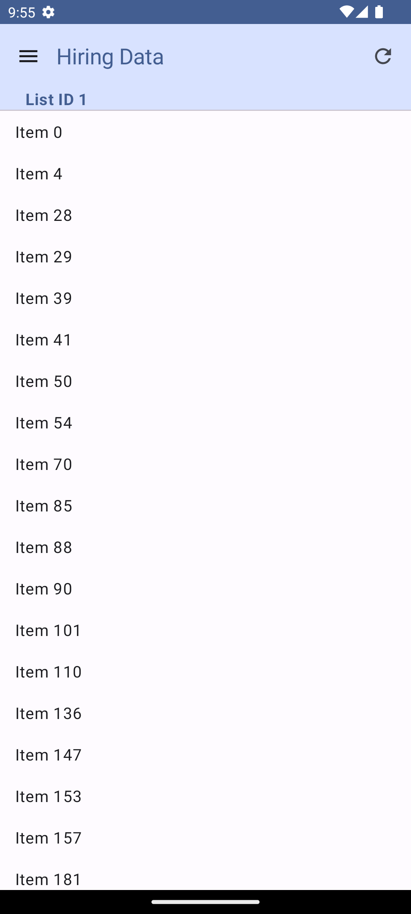

# Fetch Rewards Android Takehome
My code for the Fetch Rewards Android internship coding exercise.
The app pulls JSON data from the provided API and displays it in a user-friendly list.

Note: the app is written in Kotlin and uses the new Jetpack Compose UI toolkit.

## Exercise specifications
1. Fetch data from https://fetch-hiring.s3.amazonaws.com/hiring.json.
2. Filter out any items where "name" is blank or null
3. Sort the results first by "listId" then by "name"
4. Display all the items grouped by "listId"

## Build
1. Install [Android Studio](https://developer.android.com/studio/install.html).
2. Clone this repository.
3. Import the project into Android Studio.
4. Build and run the app.

## Demo

